# C++居然能写到3

## include头文件的顺序以及双引号””和尖括号<>的区别？

Include头文件的顺序：对于include的头文件来说，如果在文件a.h中声明一个在文件b.h中定义的变量，而不引用b.h。那么要在a.c文件中引用b.h文件，并且要先引用b.h，后引用a.h,否则汇报变量类型未声明错误。
双引号和尖括号的区别：编译器预处理阶段查找头文件的路径不一样。

对于使用双引号包含的头文件，查找头文件路径的顺序为：

当前头文件目录

编译器设置的头文件路径（编译器可使用-I显式指定搜索路径）

系统变量CPLUS_INCLUDE_PATH/C_INCLUDE_PATH指定的头文件路径

对于使用尖括号包含的头文件，查找头文件的路径顺序为：

编译器设置的头文件路径（编译器可使用-I显式指定搜索路径）

系统变量CPLUS_INCLUDE_PATH/C_INCLUDE_PATH指定的头文件路径

## malloc的原理，另外brk系统调用和mmap系统调用的作用分别是什么？
Malloc函数用于动态分配内存。为了减少内存碎片和系统调用的开销，malloc其采用内存池的方式，先申请大块内存作为堆区，然后将堆区分为多个内存块，以块作为内存管理的基本单位。当用户申请内存时，直接从堆区分配一块合适的空闲块。Malloc采用隐式链表结构将堆区分成连续的、大小不一的块，包含已分配块和未分配块；同时malloc采用显示链表结构来管理所有的空闲块，即使用一个双向链表将空闲块连接起来，每一个空闲块记录了一个连续的、未分配的地址。

当进行内存分配时，Malloc会通过隐式链表遍历所有的空闲块，选择满足要求的块进行分配；当进行内存合并时，malloc采用边界标记法，根据每个块的前后块是否已经分配来决定是否进行块合并。

Malloc在申请内存时，一般会通过brk或者mmap系统调用进行申请。其中当申请内存小于128K时，会使用系统函数brk在堆区中分配；而当申请内存大于128K时，会使用系统函数mmap在映射区分配。

## C++的内存管理是怎样的？
在C++中，虚拟内存分为代码段、数据段、BSS段、堆区、文件映射区以及栈区六部分。

- 代码段:包括只读存储区和文本区，其中只读存储区存储字符串常量，文本区存储程序的机器代码。
- 数据段：存储程序中已初始化的全局变量和静态变量
- bss 段：存储未初始化的全局变量和静态变量（局部+全局），以及所有被初始化为0的全局变量和静态变量。
- 堆区：调用new/malloc函数时在堆区动态分配内存，同时需要调用delete/free来手动释放申请的内存。
- 映射区:存储动态链接库以及调用mmap函数进行的文件映射
- 栈：使用栈空间存储函数的返回地址、参数、局部变量、返回值

## 如何判断内存泄漏
内存泄漏通常是由于调用了malloc/new等内存申请的操作，但是缺少了对应的free/delete。为了判断内存是否泄露，我们一方面可以使用linux环境下的内存泄漏检查工具Valgrind,另一方面我们在写代码时可以添加内存申请和释放的统计功能，统计当前申请和释放的内存是否一致，以此来判断内存是否泄露。

## 什么时候会发生段错误
段错误通常发生在访问非法内存地址的时候，具体来说分为以下几种情况：

- 使用野指针
- 试图修改字符串常量的内容

## 共享内存相关api
Linux允许不同进程访问同一个逻辑内存，提供了一组API，头文件在sys/shm.h中。

1）新建共享内存shmget

int shmget(key_t key,size_t size,int shmflg);

2）连接共享内存到当前进程的地址空间shmat

void *shmat(int shm_id,const void *shm_addr,int shmflg);

3）当前进程分离共享内存shmdt

int shmdt(const void *shmaddr);

4）控制共享内存shmctl

和信号量的semctl函数类似，控制共享内存

int shmctl(int shm_id,int command,struct shmid_ds *buf);

## 如何采用单线程的方式处理高并发
在单线程模型中，可以采用I/O复用来提高单线程处理多个请求的能力，然后再采用事件驱动模型，基于异步回调来处理事件。

## C++11有哪些新特性
C++11 最常用的新特性如下：

- auto关键字：编译器可以根据初始值自动推导出类型。但是不能用于函数传参以及数组类型的推导
- nullptr关键字：nullptr是一种特殊类型的字面值，它可以被转换成任意其它的指针类型；而NULL一般被宏定义为0，在遇到重载时可能会出现问题。
- 智能指针：C++11新增了std::shared_ptr、std::weak_ptr等类型的智能指针，用于解决内存管理的问题。
- 初始化列表：使用初始化列表来对类进行初始化
- 右值引用：基于右值引用可以实现移动语义和完美转发，消除两个对象交互时不必要的对象拷贝，节省运算存储资源，提高效率
- atomic原子操作用于多线程资源互斥操作
- 新增STL容器array以及tuple

## C++11中的可变参数模板、右值引用和lambda这几个新特性
### 可变参数模板

C++11的可变参数模板，对参数进行了高度泛化，可以表示任意数目、任意类型的参数，其语法为：在class或typename后面带上省略号...。

例如：
```cpp
template <class... T>
void f(T... args)
{    
    cout << sizeof...(args) << endl; //打印变参的个数
}
```

func();//args不含任何参数

func(1);//args包含一个int类型的实参

func(1,2.0)//args包含一个int一个double类型的实参

其中T叫做模板参数包，args叫做函数参数包

省略号作用如下：

1）声明一个包含0到任意个模板参数的参数包

2）在模板定义得右边，可以将参数包展成一个个独立的参数

C++11可以使用递归函数的方式展开参数包，获得可变参数的每个值。通过递归函数展开参数包，需要提供一个参数包展开的函数和一个递归终止函数。例如：

```cpp
//递归终止函数
void print()
{
   cout << "empty" << endl;
}
//展开函数
template <class T, class ...Args>
void print(T head, Args... rest)
{
   cout << "parameter " << head << endl;
   print(rest...);
}
```

参数包Args...在展开的过程中递归调用自己，每调用一次，参数包中的参数就会少一个，直到所有参数都展开为止。当没有参数时就会调用非模板函数print终止递归过程。

### 右值引用
C++中，左值通常指可以取地址，有名字的值就是左值，而不能取地址，没有名字的就是右值。而在C++11中，右值是由两个概念构成，将亡值和纯右值。纯右值是用于识别临时变量和一些不跟对象关联的值，比如1+3产生的临时变量值，2、true等，而将亡值通常是指具有转移语义的对象，比如返回右值引用T&&的函数返回值等。

C++11中，右值引用就是对一个右值进行引用的类型。由于右值通常不具有名字，所以我们一般只能通过右值表达式获得其引用，比如：

```cpp
T && a=ReturnRvale();
```

假设ReturnRvalue()函数返回一个右值，那么上述语句声明了一个名为a的右值引用，其值等于ReturnRvalue函数返回的临时变量的值。

基于右值引用可以实现转移语义和完美转发新特性。

#### 转移语义
对于一个包含指针成员变量的类，由于编译器默认的拷贝构造函数都是浅拷贝，所有我们一般需要通过实现深拷贝的拷贝构造函数，为指针成员分配新的内存并进行内容拷贝，从而避免悬挂指针的问题。

但是如下列代码所示：

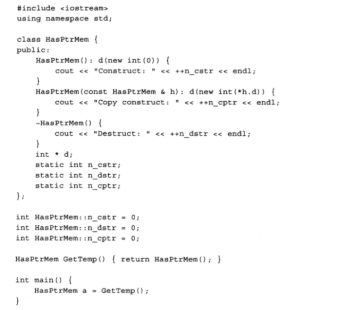

当类HasPtrMem包含一个成员函数GetTemp,其返回值类型是HasPtrMem,如果我们定义了深拷贝的拷贝构造函数，那么在调用该函数时需要调用两次拷贝构造函数。第一次是生成GetTemp函数返回时的临时变量，第二次是将该返回值赋值给main函数中的变量a。与此对应需要调用三次析构函数来释放内存。

而在上述过程中，使用临时变量构造a时会调用拷贝构造函数分配对内存，而临时对象在语句结束后会释放它所使用的堆内存。这样重复申请和释放内存，在申请内存较大时会严重影响性能。因此C++使用移动构造函数，从而保证使用临时对象构造a时不分配内存，从而提高性能。

如下列代码所示，移动构造函数接收一个右值引用作为参数，使用右值引用的参数初始化其指针成员变量。

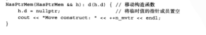

其原理就是使用在构造对象a时，使用h.d来初始化a，然后将临时对象h的成员变量d指向nullptr，从而保证临时变量析构时不会释放对内存。

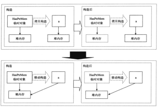

#### 完美转发
完美转发是指在函数模板中，完全依照模板的参数的类型，将参数传递给函数模板中调用的另一个函数，即传入转发函数的是左值对象，目标函数就能获得左值对象，转发函数是右值对象，目标函数就能获得右值对象，而不产生额外的开销。

因此转发函数和目标函数参数一般采用引用类型，从而避免拷贝的开销。其次，由于目标函数可能需要能够既接受左值引用，又接受右值引用，所以考虑转发也需要兼容这两种类型。

C++11采用引用折叠的规则，结合新的模板推导规则实现完美转发。其引用折叠规则如下：

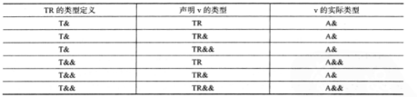

因此，我们将转发函数和目标函数的参数都设置为右值引用类型，

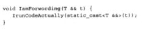

当传入一个X类型的左值引用时，转发函数将被实例为：

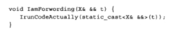

经过引用折叠，变为：

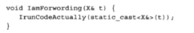

当传入一个X类型的右值引用时，转发函数将被实例为：

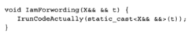

经过引用折叠，变为：

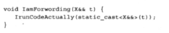

除此之外，还可以使用forward()函数来完成左值引用到右值引用的转换：

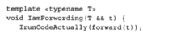

### Lambda表达式
Lambda表达式定义一个匿名函数，并且可以捕获一定范围内的变量，其定义如下：

\[capture\](params)mutable->return-type{statement}

其中，

\[capture\]：捕获列表，捕获上下文变量以供lambda使用。同时[]是lambda寅初复，编译器根据该符号来判断接下来代码是否是lambda函数。

(Params)：参数列表，与普通函数的参数列表一致，如果不需要传递参数，则可以连通括号一起省略。

mutable是修饰符，默认情况下lambda函数总是一个const函数，Mutable可以取消其常量性。在使用该修饰符时，参数列表不可省略。

->return-type:返回类型是返回值类型

{statement}:函数体，内容与普通函数一样，除了可以使用参数之外，还可以使用所捕获的变量。

Lambda表达式与普通函数最大的区别就是其可以通过捕获列表访问一些上下文中的数据。其形式如下:

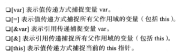

Lambda的类型被定义为“闭包”的类，其通常用于STL库中，在某些场景下可用于简化仿函数的使用，同时Lambda作为局部函数，也会提高复杂代码的开发加速，轻松在函数内重用代码，无须费心设计接口。