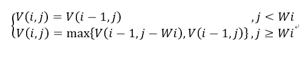

# 动态规划

## 背包问题

背包问题分为三类：
1. 0-1背包
2. 完全背包
3. 多重背包

记得这个状态转移方程就行：

二维表可以降为一维表（降低空间复杂度）。0-1背包内循环逆序，完全背包内循环正序，这一点非常有趣，值得思考。实际上是因为0-1背包第i个物体的表应该又第i-1个物品的表来更新（因为只有一个），而完全背包第i个物体的表应该由当前表更新（因为可以取多个）。

对于多重背包问题，可以转化为0-1问题，转化的方式为二进制转化。

先简单写个重点，后面再仔细补充。

参考：[背包详解（0-1背包，完全背包，多重背包）](https://blog.csdn.net/Septembre_/article/details/81111812)

