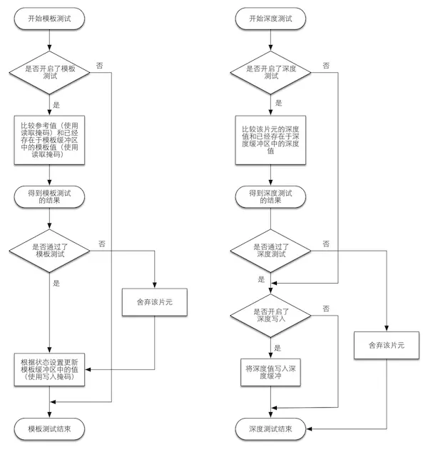

# 图形学相关的东西

基于冯乐乐大佬的《Unity Shader入门精要》。

## 重要：程序员的三个浪漫
编译原理，操作系统，**图形学**

## 渲染管线
分为三个阶段，分别是：应用阶段，几何阶段，光栅化阶段。

### 应用阶段（CPU）
1. 把数据加载到显存。
2. 设置渲染状态（定义了网格是怎样被渲染的，包括顶点着色器，片元着色器，光源属性，材质等）。
3. 调用Draw Call。

### 几何阶段（GPU）
把顶点坐标变换到屏幕空间中，再交给光栅器进行处理。

可以细分为五个子阶段：
1. 顶点着色器：负责顶点的空间变换（把顶点坐标从模型空间转换到齐次裁剪空间），顶点着色。
2. 曲面细分着色器：细分图元。
3. 几何着色器：执行逐图元的着色操作，或者被用于产生更多的图元。
4. 裁剪：将不在摄像机内的顶点裁剪掉。
5. 屏幕映射：将每个图元的x和y坐标转换到屏幕坐标系。

### 光栅化阶段（GPU）
使用上一个阶段传递来的数据来产生屏幕上的像素，并渲染出最终的图像。

可以细分为四个子阶段：
1. 三角形设置：计算光栅化一个三角网格所需的信息。
2. 三角形遍历：检查每个像素是否被一个三角网格覆盖，并生成片元。
3. 片元着色器：着色每个片元，输入是上一个阶段对顶点信息插值得到的结果。
4. 逐片元操作：输出合并阶段，决定每个片元的可见性（模版测试和深度测试），并混合。

#### 模版测试和深度测试
模版测试就是将片元着色器输出的着色后的片元信息和一个模版进行比较，以舍弃部分片元。通常用于限制渲染的区域，也可以用于渲染阴影，轮廓渲染等。

深度测试实际上就是将片元按照远近遮挡关系进行过滤。

#### 合并
决定了片元最终输出到颜色缓冲区时，和原颜色的混合方式。

## 一些数学

### 四维齐次坐标
加了第四维w的目的在于使坐标除了旋转和拉伸外，还能够进行平移操作。w=1对应一个点，w=0对应一个方向。

参考：[计算机图形学之四维齐次坐标](https://www.cnblogs.com/J1ac/p/9340622.html)

### 平移矩阵
$$\left[ \begin{matrix} 1 & 0 & 0 & t_x \\ 0 & 1 & 0 & t_y \\ 0 & 0 & 1 & t_z \\ 0 & 0 & 0 & 1 \end{matrix} \right]$$

### 缩放矩阵

$$\left[ \begin{matrix} k_x & 0 & 0 & 0 \\ 0 & k_y & 0 & 0 \\ 0 & 0 & k_z & 0 \\ 0 & 0 & 0 & 1 \end{matrix} \right]$$

### 旋转矩阵

$$R_x(\theta) = \left[ \begin{matrix} 1 & 0 & 0 & 0 \\ 0 & cos(\theta) & -sin(\theta) & 0 \\ 0 & sin(\theta) & cos(\theta) & 0 \\ 0 & 0 & 0 & 1 \end{matrix} \right]$$

$$R_y(\theta) = \left[ \begin{matrix} cos(\theta) & 0 & sin(\theta) & 0 \\ 0 & 1 & 0 & 0 \\ -sin(\theta) & 0 & cos(\theta) & 0 \\ 0 & 0 & 0 & 1 \end{matrix} \right]$$

$$R_z(\theta) = \left[ \begin{matrix} cos(\theta) & -sin(\theta) & 0 & 0 \\ sin(\theta) & cos(\theta) & 0 & 0 \\ 0 & 0 & 1 & 0 \\ 0 & 0 & 0 & 1 \end{matrix} \right]$$

### 复合变换
先缩放，再旋转，再平移（右乘）。

$$P_{new} = M_{translation}M_{rotation}M_{scale}P_{old}$$

Unity中的旋转顺序为：zxy

$$M_{rotation} = M_z M_x M_y$$

为什么顺序倒了是因为Unity默认旋转时不旋转坐标轴。

## 基础光照
着色指的就是根据材质属性（如漫反射属性等）、光源信息（如光源方向、辐射度等），使用一个等式去计算沿某个观察方向的出射度的过程，这个等式成为光照模型。

### BRDF光照模型
BRDF：Bidirectional Reflectance Distribution Function

BRDF大多用一个数学公式表示，并且提供了一些参数来调整材质属性。通俗的讲，当给定入射入射光线的方向和辐射度后，BRDF可以给出在某个出射方向的光照能量分布。

### 标准光照模型（Phong光照模型）
标准光照模型只关心直接光照，即那些直接从光源发射出来照射到物体表面后，经过物体表面的**一次**反射直接进入摄像机的光线。

#### 光源类型
1. 自发光：物体自发对外的辐射量。
2. 环境光：其它所有间接光照。
3. 高光反射：完全镜面反射的辐射量。
4. 漫反射：散射的辐射量。
   
#### 环境光
通常是一个全局变量。
$$c_{ambient} = g_{ambient}$$

#### 自发光
通常直接使用该材质的自发光颜色。
$$c_{emissive} = m_{emissive}$$

#### 漫反射
漫反射是完全随机的，可以认为在任何反射反向上的分布都是一样的（跟观察角度无关）。

漫反射光照符合兰伯特定律，即反射光线的强度与表面法线和光源之间的夹角的余弦值成正比。
$$c_{diffuse} = (c_{light} \dot m_{diffuse} max(0, n \dot l)$$

半兰伯特光照模型：解决背光面全黑的问题。
$$c_{diffuse} = (c_{light} \dot m_{diffuse} (\alpha (n \dot l) + \beta)$$

#### 高光反射
经验模型，只考虑完全镜面反射。

反射光计算：
$$r = 2(n \dot l)n - l$$

高光反射颜色：
$$ c_{specular} = (c_{light} \dot m_{specular}) max(0, v \dot r)^{m_{gloss}} $$

其中$$m_{gloss}$$是材质的光泽度。

Blinn-Phong光照模型：简化高光反射计算。
$$ h = \div{v + l}{|v + l|} $$

$$ c_{specular} = (c_{light} \dot m_{specular}) max(0, n \dot h)^{m_{gloss}} $$

#### 两种方式
逐像素光照：为每个像素为基础，得到它的法线（对顶点法线插值或法线纹理采样），然后进行光照模型的计算。这种在面片之间对顶点法线进行插值的技术被称为**Phong着色**。
逐顶点光照：我们在每个顶点上计算光照，然后会在渲染图元内部进行线性插值，最后输出成像素颜色（Gouraud着色）。

## 纹理
纹理映射技术，使用一张图片来控制模型的外观，每个顶点会存储一个纹理映射坐标（UV坐标），对应纹理图上的位置。

### 多级渐远纹理（mipmapping）
将纹理提前用滤波来得到更多很小的图像，形成了一个图像金字塔，每一层都是对上一层图像降采样的结果。这样实时运行时，就可以快速得到结果像素，例如当物体远离摄像机时，可以直接使用较小的纹理。典型的空间换时间，提高渲染效率的同时，一定程度上解决因表面与纹理相比过小而导致的闪烁问题。

### 凹凸映射
使用一张纹理来修改模型表面的法线，为模型提供更多的细节。这种方法不会真的改变模型的顶点位置，只是让模型看起来好像是“凹凸不平”的。

#### 高度纹理（height map）
用一张高度图实现凹凸映射，图中存储的是强度值，表示模型表面局部的海拔高度，越浅越向外凸起，越深越向内凹陷。优点是直观，缺点是需要复杂的运算，因为在实时计算中不能直接得到表面法线，而需要又像素的灰度值计算。

#### 法线纹理（normal map）
法线纹理中存储的就是表面的法线方向。

有两种实现形式，取决于相应的坐标空间：
1. 模型空间：即定义在模型空间中。
2. 切线空间：对于模型的每个顶点，原点即顶点本身，z轴为顶点的法线，x轴为顶点的切线，y轴又法线和切线的叉积获得，又称为副切线（bitangent）。

模型空间优点：
1. 简单，直观。
2. 在纹理坐标的缝合处和尖锐的边角部分，可见的突变较少（因为边界处通过插值得到的法线可以平滑变换）。

切线空间优点：
1. 自由度高，可应用到一个完全不同的网格（模型空间不行）。
2. 可进行UV动画。
3. 可重用。
4. 可压缩，只需xy方向，z方向可以计算得到。

因此一般使用切线空间的法线纹理。

这里有点复杂，最好看书或网上找资料。

## 透明效果
在实时渲染中要实现透明效果，通常会在渲染模型时控制它的透明通道（alpha channel）。

### 透明度测试
一个片元的透明度不满足条件，那么便被舍弃。

### 透明度混合
真正的半透明效果。它会使用当前片元的透明度作为混合因子，与已经存储在颜色缓冲区的颜色值进行混合，得到新的颜色（需要关闭深度写入）。

#### 渲染顺序的重要性
由于关闭了深度写入，不同的渲染顺序会得到不同的结果。

常用的方法：
1. 先渲染所有不透明物体，并开启它们的深度测试和深度写入。
2. 把半透明物体按它们距离摄像机的远近进行排序，然后按照从远到近的顺序渲染这些半透明物体，并开启它们的深度测试，但关闭深度写入。

## 渲染路径

### 向前渲染路径
每一次完整的向前渲染，我们需要渲染该对象的渲染图元，并计算两个缓冲区的信息：一个是颜色缓冲区，一个是深度缓冲区。我们利用深度缓冲来决定一个片元是否可见，如果可见就更新颜色缓冲区的颜色值。

假设场景中有N个物体，每个物体受M个光源的影响，那么要渲染整个场景一共需要N*M个Pass。

Unity中的向前渲染路径有三种处理光照的方式：逐顶点光照，逐像素光照，球谐函数（Spherical harmonics，SH）。

### 顶点照明渲染路径
顶点照明渲染路径是对硬件配置要求最少，运算性能最高，但同时也是得到的效果最差的一种类型，仅支持逐顶点光照。

### 延迟渲染
延迟渲染除了利用颜色缓冲和深度缓冲外，还会利用额外的缓冲区（G-buffer）来存储我们所关心的表面的其它信息，例如该表面的法线，位置，用于光照计算的材质属性等。

延迟渲染主要分为两个Pass：
1. 不进行任何光照计算，仅计算哪些片元是可见的（通过深度缓冲实现），并把可见片元的相关信息存储到G缓冲中。
2. 利用G缓冲区的各个片元信息，例如表面法线、视角方向、漫反射系数等，进行真正的光照计算。

延迟渲染的效率不依赖于场景的复杂度，而是和我们使用的屏幕空间的大小有关，此外还需要一定的硬件支持。

## Unity的光源类型
1. 平行光
2. 点光源
3. 聚光灯
4. 面光源（仅在烘培时才发挥作用）

## 阴影
在实时渲染中，我们最常使用的是一种名为**Shadow Map**的技术。它会首先将摄像机的位置放在与光源重合的位置上，那么场景中该光源的阴影区域就是那些摄像机看不到的地方。

阴影映射纹理本质上也是一张深度图，它记录了从该光源的位置出发，能看到的场景中距离它最近的表面位置（深度信息）。

## 移动平台-TBDR
基于瓦片的延迟渲染（Tile-based Deferred Rendering, TBDR）。

PowerVR芯片（通常用于IOS设备和某些Android设备），把所有的渲染图像装入一个个瓦片中，再有硬件找到可见的片元，而只有这些可见片元才会执行片元着色器。

另一些基于瓦片的GPU架构，，如Adreno（高通的芯片）和Mali（ARM的芯片）则会使用Early-Z或者相似的技术进行一个低精度的深度检测，来剔除那些不需要渲染的片元。