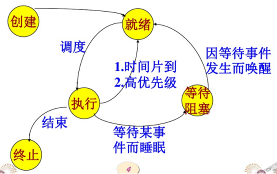
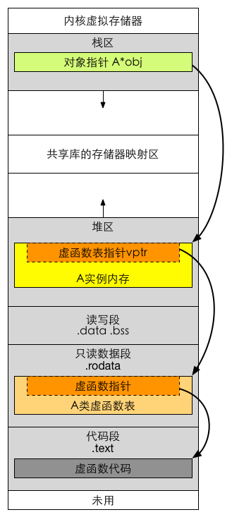

# 操作系统相关知识点 2

## 互斥锁（mutex）机制，以及互斥锁和读写锁的区别
互斥锁：mutex，用于保证在任何时刻，都只能有一个线程访问该对象。当获取锁操作失败时，线程会进入睡眠，等待锁释放时被唤醒。

读写锁：rwlock，分为读锁和写锁。处于读操作时，可以允许多个线程同时获得读操作。但是同一时刻只能有一个线程可以获得写锁。其它获取写锁失败的线程都会进入睡眠状态，直到写锁释放时被唤醒。 注意：写锁会阻塞其它读写锁。当有一个线程获得写锁在写时，读锁也不能被其它线程获取；写者优先于读者（一旦有写者，则后续读者必须等待，唤醒时优先考虑写者）。适用于读取数据的频率远远大于写数据的频率的场合。

## Linux的四种锁机制
1. 互斥锁：mutex，用于保证在任何时刻，都只能有一个线程访问该对象。当获取锁操作失败时，线程会进入睡眠，等待锁释放时被唤醒
2. 读写锁：rwlock，分为读锁和写锁。处于读操作时，可以允许多个线程同时获得读操作。但是同一时刻只能有一个线程可以获得写锁。其它获取写锁失败的线程都会进入睡眠状态，直到写锁释放时被唤醒。 注意：写锁会阻塞其它读写锁。当有一个线程获得写锁在写时，读锁也不能被其它线程获取；写者优先于读者（一旦有写者，则后续读者必须等待，唤醒时优先考虑写者）。适用于读取数据的频率远远大于写数据的频率的场合。
3. 自旋锁：spinlock，在任何时刻同样只能有一个线程访问对象。但是当获取锁操作失败时，不会进入睡眠，而是会在原地自旋，直到锁被释放。这样节省了线程从睡眠状态到被唤醒期间的消耗，在加锁时间短暂的环境下会极大的提高效率。但如果加锁时间过长，则会非常浪费CPU资源。
4. RCU：即read-copy-update，在修改数据时，首先需要读取数据，然后生成一个副本，对副本进行修改。修改完成后，再将老数据update成新的数据。使用RCU时，读者几乎不需要同步开销，既不需要获得锁，也不使用原子指令，不会导致锁竞争，因此就不用考虑死锁问题了。而对于写者的同步开销较大，它需要复制被修改的数据，还必须使用锁机制同步并行其它写者的修改操作。在有大量读操作，少量写操作的情况下效率非常高。参考：[Linux RCU锁简析](https://blog.csdn.net/zhuhaishi/article/details/50531399)

## 进程状态转换图，动态就绪，静态就绪，动态阻塞，静态阻塞

### 进程的五种基本状态

1. 创建状态：进程正在被创建
2. 就绪状态：进程被加入到就绪队列中等待CPU调度运行
3. 执行状态：进程正在被运行
4. 等待阻塞状态：进程因为某种原因，比如等待I/O，等待设备，而暂时不能运行。
5. 终止状态：进程运行完毕

### 交换技术
当多个进程竞争内存资源时，会造成内存资源紧张，并且，如果此时没有就绪进程，处理机会空闲，I/0速度比处理机速度慢得多，可能出现全部进程阻塞等待I/O。

针对以上问题，提出了两种解决方法：
1. 交换技术：换出一部分进程到外存，腾出内存空间。
2. 虚拟存储技术：每个进程只能装入一部分程序和数据。

在交换技术上，将内存暂时不能运行的进程，或者暂时不用的数据和程序，换出到外存，来腾出足够的内存空间，把已经具备运行条件的进程，或进程所需的数据和程序换入到内存。

从而出现了进程的挂起状态：进程被交换到外存，进程状态就成为了挂起状态。

### 活动阻塞，静止阻塞，活动就绪，静止就绪
1. 活动阻塞：进程在内存，但是由于某种原因被阻塞了。
2. 静止阻塞：进程在外存，同时被某种原因阻塞了。
3. 活动就绪：进程在内存，处于就绪状态，只要给CPU和调度就可以直接运行。
4. 静止就绪：进程在外存，处于就绪状态，只要调度到内存，给CPU和调度就可以运行。

## A* a = new A; a->i = 10;在内核中的内存分配上发生了什么？
1. A *a：a是一个局部变量，类型为指针，故而操作系统在程序栈区开辟4/8字节的空间（0x000m），分配给指针a。
2. new A：通过new动态的在堆区申请类A大小的空间（0x000n）。
3. a = new A：将指针a的内存区域填入栈中类A申请到的地址的地址。即*（0x000m）=0x000n。
4. a->i：先找到指针a的地址0x000m，通过a的值0x000n和i在类a中偏移offset，得到a->i的地址0x000n + offset，进行*(0x000n + offset) = 10的赋值操作，即内存0x000n + offset的值是10。

## 给你一个类，里面有static，virtual，之类的，来说一说这个类的内存分布?

### Static
静态数据成员在全局数据区分配内存，属于本类的所有对象共享，所以它不属于特定的类对象，在没有产生类对象前就可以使用。

Static修饰的成员函数，在代码区分配内存。

### Virtual
如果一个类是局部变量则该类数据存储在栈区，如果一个类是通过new/malloc动态申请的，则该类数据存储在堆区。

如果该类是virutal继承而来的子类，则该类的虚函数表指针和该类其他成员一起存储。虚函数表指针指向只读数据段中的类虚函数表，虚函数表中存放着一个个函数指针，函数指针指向代码段中的具体函数。

如果类中成员是virtual属性，会隐藏父类对应的属性。

## 软链接和硬链接区别
为了解决文件共享问题，Linux引入了软链接和硬链接。除了为Linux解决文件共享使用，还带来了隐藏文件路径、增加权限安全及节省存储等好处。

若1个inode号对应多个文件名，则为硬链接，即硬链接就是同一个文件使用了不同的别名，使用ln创建，对其中一个文件的修改都会同步到其他文件上。若文件用户数据块中存放的内容是另一个文件的路径名指向（相当于快捷方式），则该文件是软连接。软连接是一个普通文件，有自己独立的inode，但是其数据块内容比较特殊。

参考：[软链接和硬链接到底有啥作用和区别](https://www.nowcoder.com/tutorial/93/7474823e71be4850a4b856290d230e20)

## 请问什么是大端小端以及如何判断大端小端
大端是指低字节存储在高地址；小端存储是指低字节存储在低地址。我们可以根据联合体来判断该系统是大端还是小端。因为联合体成员共用一个空间。

参考：[联合体 利用联合体判断大小端](https://blog.csdn.net/sophia__yu/article/details/79508786)

## 静态变量什么时候初始化
静态变量存储在虚拟地址空间的数据段和bss段，C语言中其在代码执行之前初始化，属于编译期初始化。而C++中由于引入对象，对象生成必须调用构造函数，因此C++规定全局或局部静态对象当且仅当对象首次用到时进行构造。

## 用户态和内核态区别
用户态和内核态是操作系统的两种运行级别，两者最大的区别就是特权级不同。用户态拥有最低的特权级，内核态拥有较高的特权级。运行在用户态的程序不能直接访问操作系统内核数据结构和程序。内核态和用户态之间的转换方式主要包括：系统调用（主动），异常和中断（被动）。

参考：[用户态和内核态的理解和区别](https://blog.csdn.net/qq_39823627/article/details/78736650)

## 如何设计server，使得能够接收多个客户端的请求
多线程，线程池，io复用

IO多路复用可参考：[I/O复用的理解](https://blog.csdn.net/xd_rbt_/article/details/80287959)

## 死循环+来连接时新建线程的方法效率有点低，怎么改进？
提前创建好一个线程池，用生产者消费者模型，创建一个任务队列，队列作为临界资源，有了新连接，就挂在到任务队列上，队列为空所有线程睡眠。改进死循环：使用select epoll这样的技术。

## 怎么唤醒被阻塞的socket线程？
1. 关闭并清理对应的读写通道。
2. 使用非阻塞模型。
3. 设置socket发送/接受超时。

参考：[如何唤醒socket被阻塞的函数](https://blog.csdn.net/learnboc/article/details/72460467)

## 怎样确定当前线程是繁忙还是阻塞？
用ps查看，用个域"STAT"表示进程所处的状态，"S"和"R"分别表示阻塞和繁忙。

## 就绪状态的进程在等待什么？
被调度使用cpu的运行权。

## 两个进程访问临界区资源，会不会出现都获得自旋锁的情况？
单核cpu，并且开了抢占可以造成这种情况。即低优先级进程先获得锁，而后高优先级进程剥夺了低优先级的CPU使用权，然后陷入自旋。

关于抢占式内核和非抢占式内核可参考：[Linux用户抢占和内核抢占详解](https://blog.csdn.net/gatieme/article/details/51872618)

## Windows消息机制
当用户有操作(鼠标，键盘等)时，系统会将这些事件转化为消息。每个打开的进程系统都为其维护了一个消息队列，系统会将这些消息放到进程的消息队列中，而应用程序会循环从消息队列中取出来消息，完成对应的操作。

## 说一说你用到的锁
生产者消费者问题利用互斥锁和条件变量可以很容易解决，条件变量这里起到了替代信号量的作用。

个人理解：互斥锁用于对商品队列进行保护（每次只有一个线程访问），条件变量用于通知。

生产者消费者模型可参考：[Linux多线程消费者和生产者模型实例](https://blog.csdn.net/linux_ever/article/details/50216585)

## 请你说一说内存溢出和内存泄漏

### 内存溢出
指程序申请内存时，没有足够的内存供申请者使用。内存溢出就是你要的内存空间超过了系统实际分配给你的空间，此时系统相当于没法满足你的需求，就会报内存溢出的错误。

内存溢出原因：
1. 内存中加载的数据量过于庞大，如一次从数据库取出过多数据
2. 集合类中有对对象的引用，使用完后未清空，使得不能回收（实际上就是内存泄露）
3. 代码中存在死循环或循环产生过多重复的对象实体（或者可能是一个无穷的递归）
4. 使用的第三方软件中的BUG
5. 启动参数内存值设定的过小

### 内存泄漏
内存泄漏是指由于疏忽或错误造成了程序未能释放掉不再使用的内存的情况。内存泄漏并非指内存在物理上的消失，而是应用程序分配某段内存后，由于设计错误，失去了对该段内存的控制，因而造成了内存的浪费。

内存泄漏的分类：
1. 堆内存泄漏 （Heap leak）。对内存指的是程序运行中根据需要分配通过malloc,realloc new等从堆中分配的一块内存，再是完成后必须通过调用对应的 free或者delete 删掉。如果程序的设计的错误导致这部分内存没有被释放，那么此后这块内存将不会被使用，就会产生Heap Leak。
2. 系统资源泄露（Resource Leak）。主要指程序使用系统分配的资源比如 Bitmap, handle ,SOCKET等没有使用相应的函数释放掉，导致系统资源的浪费，严重可导致系统效能降低，系统运行不稳定。
3. 没有将基类的析构函数定义为虚函数。当基类指针指向子类对象时，如果基类的析构函数不是virtual，那么子类的析构函数将不会被调用，子类的资源没有正确是释放，因此造成内存泄露。

## 常用线程模型

### Future模型

该模型通常在使用的时候需要结合Callable接口配合使用。

Future是把结果放在将来获取，当前主线程并不急于获取处理结果。允许子线程先进行处理一段时间，处理结束之后就把结果保存下来，当主线程需要使用的时候再向子线程索取。

Callable是类似于Runnable的接口，其中call方法类似于run方法，所不同的是run方法不能抛出受检异常没有返回值，而call方法则可以抛出受检异常并可设置返回值。两者的方法体都是线程执行体。

### fork&join模型

该模型包含递归思想和回溯思想，递归用来拆分任务，回溯用合并结果。可以用来处理一些可以进行拆分的大任务。其主要是把一个大任务逐级拆分为多个子任务，然后分别在子线程中执行，当每个子线程执行结束之后逐级回溯，返回结果进行汇总合并，最终得出想要的结果。

这里模拟一个摘苹果的场景：有100棵苹果树，每棵苹果树有10个苹果，现在要把他们摘下来。为了节约时间，规定每个线程最多只能摘10棵苹树以便于节约时间。各个线程摘完之后汇总计算总苹果树。

### actor模型

actor模型属于一种基于消息传递机制并行任务处理思想，它以消息的形式来进行线程间数据传输，避免了全局变量的使用，进而避免了数据同步错误的隐患。actor在接受到消息之后可以自己进行处理，也可以继续传递（分发）给其它actor进行处理。在使用actor模型的时候需要使用第三方Akka提供的框架。

### 生产者消费者模型

生产者消费者模型都比较熟悉，其核心是使用一个缓存来保存任务。开启一个/多个线程来生产任务，然后再开启一个/多个来从缓存中取出任务进行处理。这样的好处是任务的生成和处理分隔开，生产者不需要处理任务，只负责向生成任务然后保存到缓存。而消费者只需要从缓存中取出任务进行处理。使用的时候可以根据任务的生成情况和处理情况开启不同的线程来处理。比如，生成的任务速度较快，那么就可以灵活的多开启几个消费者线程进行处理，这样就可以避免任务的处理响应缓慢的问题。

### master-worker模型

master-worker模型类似于任务分发策略，开启一个master线程接收任务，然后在master中根据任务的具体情况进行分发给其它worker子线程，然后由子线程处理任务。如需返回结果，则worker处理结束之后把处理结果返回给master。