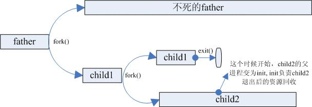

# 操作系统相关知识点 3

## 系统调用是什么，你用过哪些系统调用

### 系统调用
在计算机中，系统调用（英语：system call），又称为系统呼叫，指运行在使用者空间的程序向操作系统内核请求需要更高权限运行的服务。系统调用提供了用户程序与操作系统之间的接口（即系统调用是用户程序和内核交互的接口）。

操作系统中的状态分为管态（核心态）和目态（用户态）。大多数系统交互式操作需求在内核态执行。如设备IO操作或者进程间通信。特权指令：一类只能在核心态下运行而不能在用户态下运行的特殊指令。不同的操作系统特权指令会有所差异，但是一般来说主要是和硬件相关的一些指令。用户程序只在用户态下运行，有时需要访问系统核心功能，这时通过系统调用接口使用系统调用。

应用程序有时会需要一些危险的、权限很高的指令，如果把这些权限放心地交给用户程序是很危险的(比如一个进程可能修改另一个进程的内存区，导致其不能运行)，但是又不能完全不给这些权限。于是有了系统调用，危险的指令被包装成系统调用，用户程序只能调用而无权自己运行那些危险的指令。另外，计算机硬件的资源是有限的，为了更好的管理这些资源，所有的资源都由操作系统控制，进程只能向操作系统请求这些资源。操作系统是这些资源的唯一入口，这个入口就是系统调用。

### 用过哪些
open, read, write, fork, vfork等等

## 用户态到内核态的转化原理
三种方式分别是：系统调用，异常和外围设备中断，但它们本质上都是执行了一个中断相应的过程。

切换操作：
1. 从当前进程的描述符中提取其内核栈的ss0及esp0信息(分别对应了栈顶和栈底)。
2. 使用ss0和esp0指向的内核栈将当前进程的cs,eip，eflags，ss,esp信息（反正就是各种寄存器的信息）保存起来，这个过程也完成了由用户栈找到内核栈的切换过程，同时保存了被暂停执行的程序的下一条指令（EIP）。
3. 将先前由中断向量检索得到的中断处理程序的cs，eip信息装入相应的寄存器，开始执行中断处理程序，这时就转到了内核态的程序执行了。

## 源码到可执行文件的过程

### 预编译

主要处理源代码文件中的以“#”开头的预编译指令。

### 编译

把预编译之后生成的xxx.i或xxx.ii文件，进行一系列词法分析、语法分析、语义分析及优化后，生成相应的汇编代码文件。

### 汇编

将汇编代码转变成机器可以执行的指令(机器码文件)。 汇编器的汇编过程相对于编译器来说更简单，没有复杂的语法，也没有语义，更不需要做指令优化，只是根据汇编指令和机器指令的对照表一一翻译过来，汇编过程有汇编器as完成。经汇编之后，产生目标文件(与可执行文件格式几乎一样)xxx.o(Windows下)、xxx.obj(Linux下)。

### 链接

将不同的源文件产生的目标文件进行链接，从而形成一个可以执行的程序。链接分为静态链接和动态链接：

#### 静态链接

函数和数据被编译进一个二进制文件。在使用静态库的情况下，在编译链接可执行文件时，链接器从库中复制这些函数和数据并把它们和应用程序的其它模块组合起来创建最终的可执行文件。

空间浪费：因为每个可执行程序中对所有需要的目标文件都要有一份副本，所以如果多个程序对同一个目标文件都有依赖，会出现同一个目标文件都在内存存在多个副本；

更新困难：每当库函数的代码修改了，这个时候就需要重新进行编译链接形成可执行程序。

运行速度快：但是静态链接的优点就是，在可执行程序中已经具备了所有执行程序所需要的任何东西，在执行的时候运行速度快。

#### 动态链接

动态链接的基本思想是把程序按照模块拆分成各个相对独立部分，在程序运行时才将它们链接在一起形成一个完整的程序，而不是像静态链接一样把所有程序模块都链接成一个单独的可执行文件。

共享库：就是即使需要每个程序都依赖同一个库，但是该库不会像静态链接那样在内存中存在多份副本，而是这多个程序在执行时共享同一份副本；

更新方便：更新时只需要替换原来的目标文件，而无需将所有的程序再重新链接一遍。当程序下一次运行时，新版本的目标文件会被自动加载到内存并且链接起来，程序就完成了升级的目标。

性能损耗：因为把链接推迟到了程序运行时，所以每次执行程序都需要进行链接，所以性能会有一定损失。

## 微内核与宏内核

### 宏内核
除了最基本的进程、线程管理、内存管理外，将文件系统，驱动，网络协议等等都集成在内核里面，例如linux内核。

优点：效率高。

缺点：稳定性差，开发过程中的bug经常会导致整个系统挂掉。

### 微内核
内核中只有最基本的调度、内存管理。驱动、文件系统等都是用户态的守护进程去实现的。

优点：稳定，驱动等的错误只会导致相应进程死掉，不会导致整个系统都崩溃

缺点：效率低。典型代表QNX，QNX的文件系统是跑在用户态的进程，称为resmgr的东西，是订阅发布机制，文件系统的错误只会导致这个守护进程挂掉。不过数据吞吐量就比较不乐观了。

## 请你说一下僵尸进程

### 正常进程
正常情况下，子进程是通过父进程创建的，子进程再创建新的进程。子进程的结束和父进程的运行是一个异步过程，即父进程永远无法预测子进程到底什么时候结束。 当一个进程完成它的工作终止之后，它的父进程需要调用wait()或者waitpid()系统调用取得子进程的终止状态。

unix提供了一种机制可以保证只要父进程想知道子进程结束时的状态信息， 就可以得到：在每个进程退出的时候，内核释放该进程所有的资源，包括打开的文件，占用的内存等。 但是仍然为其保留一定的信息，直到父进程通过wait / waitpid来取时才释放。保存信息包括：

1. 进程号the process ID
2. 退出状态the termination status of the process
3. 运行时间the amount of CPU time taken by the process等

### 孤儿进程
一个父进程退出，而它的一个或多个子进程还在运行，那么那些子进程将成为孤儿进程。孤儿进程将被init进程(进程号为1)所收养，并由init进程对它们完成状态收集工作。

### 僵尸进程
一个进程使用fork创建子进程，如果子进程退出，而父进程并没有调用wait或waitpid获取子进程的状态信息，那么子进程的进程描述符仍然保存在系统中。这种进程称之为僵尸进程。

僵尸进程是一个进程必然会经过的过程：这是每个子进程在结束时都要经过的阶段。

如果子进程在exit()之后，父进程没有来得及处理，这时用ps命令就能看到子进程的状态是“Z”。如果父进程能及时 处理，可能用ps命令就来不及看到子进程的僵尸状态，但这并不等于子进程不经过僵尸状态。

如果父进程在子进程结束之前退出，则子进程将由init接管。init将会以父进程的身份对僵尸状态的子进程进行处理。

#### 危害
如果进程不调用wait / waitpid的话， 那么保留的那段信息就不会释放，其进程号就会一直被占用，但是系统所能使用的进程号是有限的，如果大量的产生僵死进程，将因为没有可用的进程号而导致系统不能产生新的进程。

#### 外部消灭
通过kill发送SIGTERM或者SIGKILL信号消灭产生僵尸进程的进程，它产生的僵死进程就变成了孤儿进程，这些孤儿进程会被init进程接管，init进程会wait()这些孤儿进程，释放它们占用的系统进程表中的资源

#### 内部解决
1. 子进程退出时向父进程发送SIGCHILD信号，父进程处理SIGCHILD信号。在信号处理函数中调用wait进行处理僵尸进程。
2. fork两次，原理是将子进程成为孤儿进程，从而其的父进程变为init进程，通过init进程可以处理僵尸进程。

如上图所示，为了避免子进程child成为僵尸进程，我们可以人为地创建一个子进程child1，再让child1成为工作子进程child2的父进程，child2出生后child1退出，这个时候child2相当于是child1产生的孤儿进程，这个孤儿进程由系统进程init回收。这样，当child2退出的时候，init就会回收child2的资源，child2就不会成为孤魂野鬼祸国殃民了。

## GDB调试用过吗，什么是条件断点?

### GDB调试
GDB 是自由软件基金会（Free Software Foundation）的软件工具之一。它的作用是协助程序员找到代码中的错误。如果没有GDB的帮助，程序员要想跟踪代码的执行流程，唯一的办法就是添加大量的语句来产生特定的输出。但这一手段本身就可能会引入新的错误，从而也就无法对那些导致程序崩溃的错误代码进行分析。

GDB的出现减轻了开发人员的负担，他们可以在程序运行的时候单步跟踪自己的代码，或者通过断点暂时中止程序的执行。此外，他们还能够随时察看变量和内存的当前状态，并监视关键的数据结构是如何影响代码运行的。

### 条件断点
条件断点是当满足条件就中断程序运行，命令：break line-or-function if expr。

例如：(gdb)break 666 if testsize==100

## 5种IO模型
1. 阻塞IO：在内核将数据准备好之前，系统调用会一直等待所有的套接字，默认的是阻塞方式。
2. 非阻塞IO：每次客户询问内核是否有数据准备好，即文件描述符缓冲区是否就绪。当有数据报准备好时，就进行拷贝数据报的操作。当没有数据报准备好时，也不阻塞程序，内核直接返回未准备就绪的信号，等待用户程序的下一个轮寻。
3. 信号驱动IO：信号驱动IO模型，应用进程告诉内核：当数据报准备好的时候，给我发送一个信号，对SIGIO信号进行捕捉，并且调用我的信号处理函数来获取数据报。
4. 多路复用IO：IO多路转接是多了一个select函数，select函数有一个参数是文件描述符集合，对这些文件描述符进行循环监听，当某个文件描述符就绪时，就对这个文件描述符进行处理。
5. 异步IO：当应用程序调用aio_read时，内核一方面去取数据报内容返回，另一方面将程序控制权还给应用进程，应用进程继续处理其他事情，是一种非阻塞的状态。当内核中有数据报就绪时，由内核将数据报拷贝到应用程序中，返回aio_read中定义好的函数处理程序。

参考：

[五种IO模型（详解+形象例子说明）](https://blog.csdn.net/ZWE7616175/article/details/80591587) \<-- 这个钓鱼的例子很不错

[信号驱动和异步驱动的区别](https://www.cnblogs.com/kamicoder/p/6476723.html)

## 异步编程的事件循环
事件循环就是不停循环等待时间的发生，然后将这个事件的所有处理器，按照他们订阅这个事件的时间顺序依次执行。当这个事件的所有处理器都被执行完毕之后，事件循环就会开始继续等待下一个事件的触发，不断往复。当同时并发地处理多个请求时，以上的概念也是正确的，可以这样理解：在单个的线程中，事件处理器是一个一个按顺序执行的。即如果某个事件绑定了两个处理器，那么第二个处理器会在第一个处理器执行完毕后，才开始执行。在这个事件的所有处理器都执行完毕之前，事件循环不会去检查是否有新的事件触发。在单个线程中，一切都是有顺序地一个一个地执行的！

## 操作系统为什么要分内核态和用户态
为了安全性。在cpu的一些指令中，有的指令如果用错，将会导致整个系统崩溃。分了内核态和用户态后，当用户需要操作这些指令时候，内核为其提供了API（即系统调用），可以通过系统调用陷入内核（产生中断），让内核去执行这些操作。

## 为什么要有page cache，操作系统怎么设计的page cache
加快从磁盘读取文件的速率。page cache中有一部分磁盘文件的缓存，因为从磁盘中读取文件比较慢，所以读取文件先去page cache中去查找，如果命中，则不需要去磁盘中读取，大大加快读取速度。

在 Linux 内核中，文件的每个数据块最多只能对应一个 Page Cache 项，它通过两个数据结构来管理这些Cache项，一个是radix tree，另一个是双向链表。Radix tree 是一种搜索树，Linux内核利用这个数据结构来通过文件内偏移快速定位Cache项。

## server端监听端口，但还没有客户端连接进来，此时进程处于什么状态？
这个需要看服务端的编程模型，如果是阻塞型IO，则处于阻塞状态，如果使用了epoll,select等这样的io复用情况下，处于运行状态（循环监听）。

参考：[select与阻塞和非阻塞](https://blog.csdn.net/rheostat/article/details/9815725)

## 就绪状态的进程在等待什么
被调度使用cpu的运行权

## 怎么实现线程池
1. 设置一个生产者消费者队列，作为临界资源
2. 初始化n个线程，并让其运行起来，加锁去队列取任务运行
3. 当任务队列为空的时候，所有线程阻塞
4. 当生产者队列来了一个任务后，先对队列加锁，把任务挂在到队列上，然后使用条件变量去通知阻塞中的一个线程