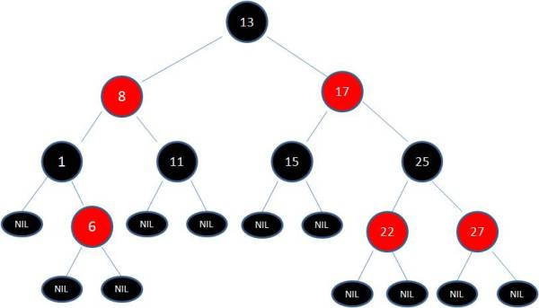
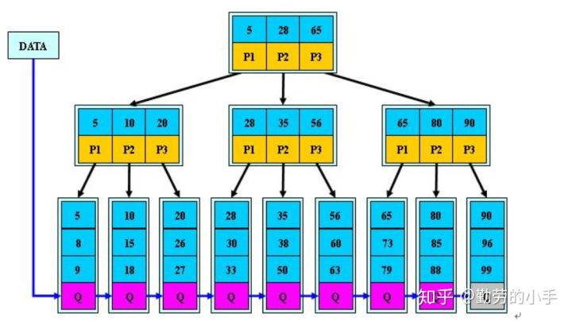

# 数据结构

## 红黑树
这里简单记录一下，不做具体的实现。

红黑树（Red Black Tree）是一种自平衡（弱平衡）的二叉查找树，除了符合二叉查找树的基本特性外，它还具有下列的附加特性：

1. 节点是红色或黑色。
2. 根节点是黑色。
3. 每个叶子节点都是黑色的空节点（NIL节点）。
4. 每个红色节点的两个子节点都是黑色。(从每个叶子到根的所有路径上不能有两个连续的红色节点)
5. 从任一节点到其每个叶子的所有路径都包含相同数目的黑色节点。

下图中这棵树，就是一颗典型的红黑树：

在插入节点和删除的过程中，红黑树通过变色和旋转来保证自身的平衡性。

### 有了二叉查找树、平衡树（AVL）为啥还需要红黑树？

二叉查找树在最坏情况下会近似退化成一条链表，这样的二叉查找树的查找时间复杂度顿时变成了O(n)。

平衡二叉树就是为了解决二叉查找树退化成一颗链表而诞生了，平衡树具有如下特点

1. 具有二叉查找树的全部特性。
2. 每个节点的左子树和右子树的高度差至多等于1。

平衡树基于这种特点就可以保证不会出现大量节点偏向于一边的情况了。于是，通过平衡树，我们解决了二叉查找树的缺点。对于有n个节点的平衡树，最坏的查找时间复杂度也为 O(logn)。

虽然平衡树解决了二叉查找树退化为近似链表的缺点，能够把查找时间控制在 O(logn)，不过却不是最佳的，因为平衡树要求每个节点的左子树和右子树的高度差至多等于1，这个要求实在是太严了，导致每次进行插入/删除节点的时候，几乎都会破坏平衡树的第二个规则，进而我们都需要通过左旋和右旋来进行调整，使之再次成为一颗符合要求的平衡树。显然，如果在那种插入、删除很频繁的场景中，平衡树需要频繁着进行调整，这会使平衡树的性能大打折扣，为了解决这个问题，于是有了红黑树。

红黑树的特点，使得它能够在最坏情况下，也能在 O(logn) 的时间复杂度查找到某个节点。不过，与平衡树不同的是，红黑树在插入、删除等操作，不会像平衡树那样，频繁着破坏红黑树的规则，所以不需要频繁着调整，这也是我们为什么大多数情况下使用红黑树的原因。

不过，单单在查找方面的效率的话，平衡树比红黑树快。

## B树和B+树
这里也只简单介绍，具体可以参考对应的文章。

参考：

[漫画：什么是B+树？ - 小灰的文章 - 知乎](https://zhuanlan.zhihu.com/p/54102723)

[平衡二叉树、B树、B+树、B*树 理解其中一种你就都明白了 - 勤劳的小手的文章 - 知乎](https://zhuanlan.zhihu.com/p/27700617)

### B树
B树属于多叉树又名平衡多路查找树（查找路径不只两个）。

规则：
1. 排序方式：所有节点关键字是按递增次序排列，并遵循左小右大原则；
2. 子节点数：非叶节点的子节点数>1，且<=M ，且M>=2，空树除外（注：M阶代表一个树节点最多有多少个查找路径，M=M路,当M=2则是2叉树,M=3则是3叉）；
3. 关键字数：枝节点的关键字数量大于等于ceil(m/2)-1个且小于等于M-1个；
4. 所有叶子节点均在同一层、叶子节点除了包含了关键字，关键字记录的指针和关键字记录的指针外也有指向其子节点的指针只不过其指针地址都为null对应下图最后一层节点的空格子；

查询：基于二分的比较。

插入：需考虑节点拆分。

删除：需考虑节点合并。

特点：B树相对于平衡二叉树的不同是，每个节点包含的关键字增多了，特别是在B树应用到数据库中的时候，数据库充分利用了磁盘块的原理（磁盘数据存储是采用块的形式存储的，每个块的大小为4K，每次IO进行数据读取时，同一个磁盘块的数据可以一次性读取出来）把节点大小限制和充分使用在磁盘块大小范围；把树的节点关键字增多后树的层级比原来的二叉树少了，减少数据查找的次数和复杂度;

### B+树
B+树是B树的一个升级版，相对于B树来说B+树更充分的利用了节点的空间，让查询速度更加稳定，其速度完全接近于二分法查找。

规则：
1. B+跟B树不同B+树的非叶子节点不保存关键字记录的指针，只进行数据索引，这样使得B+树每个非叶子节点所能保存的关键字大大增加；
2. B+树叶子节点保存了父节点的所有关键字记录的指针，所有数据地址必须要到叶子节点才能获取到。所以每次数据查询的次数都一样；
3. B+树叶子节点的关键字从小到大有序排列，左边结尾数据都会保存右边节点开始数据的指针。
4. 非叶子节点的子节点数=关键字数（这里有两种算法的实现方式，另一种为非叶节点的关键字数=子节点数-1）

特点：
1. B+树的层级更少：相较于B树B+每个非叶子节点存储的关键字数更多，树的层级更少所以查询数据更快；
2. B+树查询速度更稳定：B+所有关键字数据地址都存在叶子节点上，所以每次查找的次数都相同所以查询速度要比B树更稳定;
3. B+树天然具备排序功能：B+树所有的叶子节点数据构成了一个有序链表，在查询大小区间的数据时候更方便，数据紧密性很高，缓存的命中率也会比B树高。
4. B+树全节点遍历更快：B+树遍历整棵树只需要遍历所有的叶子节点即可，，而不需要像B树一样需要对每一层进行遍历，这有利于数据库做全表扫描。

B树相对于B+树的优点是，如果经常访问的数据离根节点很近，而B树的非叶子节点本身存有关键字其数据的地址，所以这种数据检索的时候会要比B+树快。