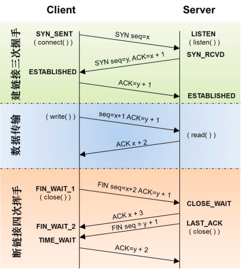
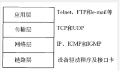
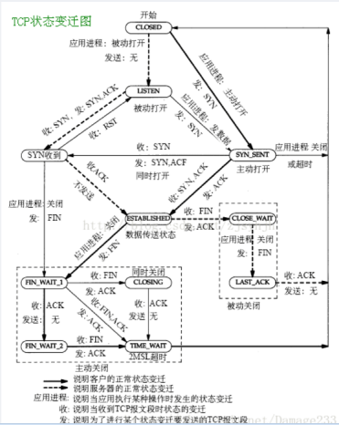

# 计算机网络知识点

## TCP怎么保证可靠性
1. 序列号，确认应答，超时重传：
   
   数据到达接收方，接收方需要发出一个确认应答，表示已经收到该数据段，并且确认序号会说明了它下一次需要接收的数据序列号。如果发送发迟迟未收到确认应答，那么可能是发送的数据丢失，也可能是确认应答丢失，这时发送方在等待一定时间后会进行重传。这个时间一般是2*RTT(报文段往返时间）+一个偏差值。

2. 窗口控制与高速重发控制/快速重传
   
   TCP会利用窗口控制来提高传输速度，意思是在一个窗口大小内，不用一定要等到应答才能发送下一段数据，窗口大小就是无需等待确认而可以继续发送数据的最大值。如果不使用窗口控制，每一个没收到确认应答的数据都要重发。

   使用窗口控制，如果数据段1001-2000丢失，后面数据每次传输，确认应答都会不停地发送序号为1001的应答，表示我要接收1001开始的数据，发送端如果收到3次相同应答，就会立刻进行重发；但还有种情况有可能是数据都收到了，但是有的应答丢失了，这种情况不会进行重发，因为发送端知道，如果是数据段丢失，接收端不会放过它的，会疯狂向它提醒......

3. 拥塞控制
   
   如果把窗口定的很大，发送端连续发送大量的数据，可能会造成网络的拥堵（大家都在用网，你在这狂发，吞吐量就那么大，当然会堵），甚至造成网络的瘫痪。所以TCP在为了防止这种情况而进行了拥塞控制。
   
   慢启动：定义拥塞窗口，一开始将该窗口大小设为1，之后每次收到确认应答（经过一个rtt），将拥塞窗口大小*2。
   
   拥塞避免：设置慢启动阈值，一般开始都设为65536。拥塞避免是指当拥塞窗口大小达到这个阈值，拥塞窗口的值不再指数上升，而是加法增加（每次确认应答/每个rtt，拥塞窗口大小+1），以此来避免拥塞。
   
   将报文段的超时重传看做拥塞，则一旦发生超时重传，我们需要先将阈值设为当前窗口大小的一半，并且将窗口大小设为初值1，然后重新进入慢启动过程。
   
   快速重传：在遇到3次重复确认应答（高速重发控制）时，代表收到了3个报文段，但是这之前的1个段丢失了，便对它进行立即重传。
   
   然后，先将阈值设为当前窗口大小的一半，然后将拥塞窗口大小设为慢启动阈值+3的大小。
   
   这样可以达到：在TCP通信时，网络吞吐量呈现逐渐的上升，并且随着拥堵来降低吞吐量，再进入慢慢上升的过程，网络不会轻易的发生瘫痪。

## TCP建立连接的过程
一图流：

### 三次握手
1. Client将标志位SYN置为1，随机产生一个值seq=J，并将该数据包发送给Server，Client进入SYN_SENT状态，等待Server确认。
2. Server收到数据包后由标志位SYN=1知道Client请求建立连接，Server将标志位SYN和ACK都置为1，ack=J+1，随机产生一个值seq=K，并将该数据包发送给Client以确认连接请求，Server进入SYN_RCVD状态。
3. Client收到确认后，检查ack是否为J+1，ACK是否为1，如果正确则将标志位ACK置为1，ack=K+1，并将该数据包发送给Server，Server检查ack是否为K+1，ACK是否为1，如果正确则连接建立成功，Client和Server进入ESTABLISHED状态，完成三次握手，随后Client与Server之间可以开始传输数据了。

### 四次挥手
由于TCP连接是全双工的，因此，每个方向都必须要单独进行关闭，这一原则是当一方完成数据发送任务后，发送一个FIN来终止这一方向的连接，收到一个FIN只是意味着这一方向上没有数据流动了，即不会再收到数据了，但是在这个TCP连接上仍然能够发送数据，直到这一方向也发送了FIN。首先进行关闭的一方将执行主动关闭，而另一方则执行被动关闭。

1. 数据传输结束后，客户端的应用进程发出连接释放报文段，并停止发送数据，客户端进入FIN_WAIT_1状态，此时客户端依然可以接收服务器发送来的数据。
2. 服务器接收到FIN后，发送一个ACK给客户端，确认序号为收到的序号+1，服务器进入CLOSE_WAIT状态。客户端收到后进入FIN_WAIT_2状态。
3. 当服务器没有数据要发送时，服务器发送一个FIN报文，此时服务器进入LAST_ACK状态，等待客户端的确认
4. 客户端收到服务器的FIN报文后，给服务器发送一个ACK报文，确认序列号为收到的序号+1。此时客户端进入TIME_WAIT状态，等待2MSL（MSL：报文段最大生存时间），然后关闭连接。

## TCP的模型

## TCP的状态转移

## HTTP和HTTPS的区别，以及HTTPS有什么缺点？
HTTP协议和HTTPS协议区别如下：
1. HTTP协议是以明文的方式在网络中传输数据，而HTTPS协议传输的数据则是经过TLS(Transport Layer Security)加密后的，HTTPS具有更高的安全性。
2. HTTPS在TCP三次握手阶段之后，还需要进行SSL的handshake，协商加密使用的对称加密密钥。
3. HTTPS协议需要服务端申请证书，浏览器端安装对应的根证书。
4. HTTP协议端口是80，HTTPS协议端口是443。

HTTPS优点：
1. HTTPS传输数据过程中使用密钥进行加密，所以安全性更高
2. HTTPS协议可以认证用户和服务器，确保数据发送到正确的用户和服务器

HTTPS缺点：
1. HTTPS握手阶段延时较高：由于在进行HTTP会话之前还需要进行SSL握手，因此HTTPS协议握手阶段延时增加
2. HTTPS部署成本高：一方面HTTPS协议需要使用证书来验证自身的安全性，所以需要购买CA证书；另一方面由于采用HTTPS协议需要进行加解密的计算，占用CPU资源较多，需要的服务器配置或数目高

## HTTP返回码
HTTP协议的响应报文由状态行、响应头部和响应包体组成，其响应状态码总体描述如下：

- 1xx：指示信息--表示请求已接收，继续处理。
- 2xx：成功--表示请求已被成功接收、理解、接受。
- 3xx：重定向--要完成请求必须进行更进一步的操作。
- 4xx：客户端错误--请求有语法错误或请求无法实现。
- 5xx：服务器端错误--服务器未能实现合法的请求。

## IP地址作用，以及MAC地址作用
MAC（Media Access Control)地址是一个硬件地址，用来定义网络设备的位置，主要由数据链路层负责。而IP地址是IP协议提供的一种统一的地址格式，为互联网上的每一个网络和每一台主机分配一个逻辑地址，以此来屏蔽物理地址的差异。

## OSI七层模型和TCP/IP四层模型，每层列举2个协议
OSI七层模型及其包含的协议如下:

- 物理层: 通过媒介传输比特,确定机械及电气规范,传输单位为bit，主要包括的协议为：IEE802.3 CLOCK RJ45
- 数据链路层: 将比特组装成帧和点到点的传递,传输单位为帧,主要包括的协议为MAC VLAN PPP
- 网络层：负责数据包从源到宿的传递和网际互连，传输单位为包,主要包括的协议为IP ARP ICMP
- 传输层：提供端到端的可靠报文传递和错误恢复，传输单位为报文,主要包括的协议为TCP UDP
- 会话层：建立、管理和终止会话，传输单位为SPDU，主要包括的协议为RPC NFS
- 表示层: 对数据进行翻译、加密和压缩,传输单位为PPDU，主要包括的协议为JPEG ASII
- 应用层: 允许访问OSI环境的手段,传输单位为APDU，主要包括的协议为FTP HTTP DNS

TCP/IP 4层模型包括：

- 网络接口层：MAC VLAN
- 网络层:IP ARP ICMP
- 传输层:TCP UDP
- 应用层:HTTP DNS SMTP

## TCP的三次握手和四次挥手的过程及原因
TCP的三次握手过程如下：

1. C -> SYN -> S
2. S -> SYN/ACK -> C
3. C -> ACK -> S

三次握手的原因：三次握手可以防止已经失效的连接请求报文突然又传输到服务器端导致的服务器资源浪费。例如，客户端先发送了一个SYN，但是由于网络阻塞，该SYN数据包在某个节点长期滞留。然后客户端又重传SYN数据包并正确建立TCP连接，然后传输完数据后关闭该连接。该连接释放后失效的SYN数据包才到达服务器端。在二次握手的前提下，服务器端会认为这是客户端发起的又一次请求，然后发送SYN ，并且在服务器端创建socket套接字，一直等待客户端发送数据。但是由于客户端并没有发起新的请求，所以会丢弃服务端的SYN 。此时服务器会一直等待客户端发送数据从而造成资源浪费。

另外看到一个不错的回答：tcp三次握手只要是为了确认线路的连通，第一次客户端发送到服务端，那么服务端就可以知道客户端的发送没有问题，但客户端不知道服务器的情况，第二次服务器发送ACK给客户端，客户端收到了证明服务端的收发都没有问题的，但服务端不知道客户端的接收情况，所以第三次是客户端再回给服务器一个ACK，服务器收到后就可以确保客户端的收发没有问题。

TCP的四次挥手过程如下：

1. C -> FIN -> S
2. S -> ACK -> C
3. S -> FIN -> C
4. C -> ACK -> S

四次挥手的原因：由于连接的关闭控制权在应用层，所以被动关闭的一方在接收到FIN包时，TCP协议栈会直接发送一个ACK确认包，优先关闭一端的通信。然后通知应用层，由应用层决定什么时候发送FIN包。应用层可以使用系统调用函数read==0来判断对端是否关闭连接。

## 搜索baidu，会用到计算机网络中的什么层？每层是干什么的

浏览器中输入URL
浏览器要将URL解析为IP地址，解析域名就要用到DNS(Domain Name System)协议，首先主机会查询DNS的缓存，如果没有就给本地DNS发送查询请求。DNS查询分为两种方式，一种是递归查询，一种是迭代查询。如果是迭代查询，本地的DNS服务器，向根域名服务器发送查询请求，根域名服务器告知该域名的一级域名服务器，然后本地服务器给该一级域名服务器发送查询请求，然后依次类推直到查询到该域名的IP地址。DNS服务器是基于UDP的，因此会用到UDP协议。

得到IP地址后，浏览器就要与服务器建立一个http连接。因此要用到http协议，http协议报文格式上面已经提到。http生成一个get请求报文，将该报文传给传输层处理，所以还会用到TCP协议。如果采用https还会使用https协议先对http数据进行加密。TCP层如果有需要先将HTTP数据包分片，分片依据路径MTU和MSS。TCP的数据包然后会发送给网络层，用到IP协议。网络层通过路由选路，一跳一跳发送到目的地址。当然在一个网段内的寻址是通过以太网协议实现(也可以是其他物理层协议，比如PPP，SLIP)，以太网协议需要直到目的IP地址的物理地址，有需要ARP协议（ARP（Address Resolution Protocol），是根据IP地址获取物理地址的一个TCP/IP协议）。

其中：

1、DNS协议，http协议，https协议属于应用层

应用层是体系结构中的最高层。应用层确定进程之间通信的性质以满足用户的需要。这里的进程就是指正在运行的程序。应用层不仅要提供应用进程所需要的信息交换和远地操作，而且还要作为互相作用的应用进程的用户代理，来完成一些为进行语义上有意义的信息交换所必须的功能。应用层直接为用户的应用进程提供服务。

2、TCP/UDP属于传输层

传输层的任务就是负责主机中两个进程之间的通信。因特网的传输层可使用两种不同协议：即面向连接的传输控制协议TCP，和无连接的用户数据报协议UDP。面向连接的服务能够提供可靠的交付，但无连接服务则不保证提供可靠的交付，它只是“尽最大努力交付”。这两种服务方式都很有用，备有其优缺点。在分组交换网内的各个交换结点机都没有传输层。

3、IP协议，ARP协议属于网络层

网络层负责为分组交换网上的不同主机提供通信。在发送数据时，网络层将运输层产生的报文段或用户数据报封装成分组或包进行传送。在TCP/IP体系中，分组也叫作IP数据报，或简称为数据报。网络层的另一个任务就是要选择合适的路由，使源主机传输层所传下来的分组能够交付到目的主机。

4、数据链路层

当发送数据时，数据链路层的任务是将在网络层交下来的IP数据报组装成帧，在两个相邻结点间的链路上传送以帧为单位的数据。每一帧包括数据和必要的控制信息（如同步信息、地址信息、差错控制、以及流量控制信息等）。控制信息使接收端能够知道—个帧从哪个比特开始和到哪个比特结束。控制信息还使接收端能够检测到所收到的帧中有无差错。

5、物理层

物理层的任务就是透明地传送比特流。在物理层上所传数据的单位是比特。传递信息所利用的一些物理媒体，如双绞线、同轴电缆、光缆等，并不在物理层之内而是在物理层的下面。因此也有人把物理媒体当做第0层。

## 请你说一说TCP拥塞控制？以及达到什么情况的时候开始减慢增长的速度？
拥塞控制是防止过多的数据注入网络，使得网络中的路由器或者链路过载。流量控制是点对点的通信量控制，而拥塞控制是全局的网络流量整体性的控制。发送双方都有一个拥塞窗口——cwnd。

1、慢开始

最开始发送方的拥塞窗口为1，由小到大逐渐增大发送窗口和拥塞窗口。每经过一个传输轮次，拥塞窗口cwnd加倍。当cwnd超过慢开始门限，则使用拥塞避免算法，避免cwnd增长过大。

2、拥塞避免

每经过一个往返时间RTT，cwnd就增长1。

在慢开始和拥塞避免的过程中，一旦发现网络拥塞，就把慢开始门限设为当前值的一半，并且重新设置cwnd为1，重新慢启动。（乘法减小，加法增大）

3、快重传

接收方每次收到一个失序的报文段后就立即发出重复确认，发送方只要连续收到三个重复确认就立即重传（尽早重传未被确认的报文段）。

4、快恢复

当发送方连续收到了三个重复确认，就乘法减半（慢开始门限减半），将当前的cwnd设置为慢开始门限，并且采用拥塞避免算法（连续收到了三个重复请求，说明当前网络可能没有拥塞）。

采用快恢复算法时，慢开始只在建立连接和网络超时才使用。

达到什么情况的时候开始减慢增长的速度？

采用慢开始和拥塞避免算法的时候

1. 一旦cwnd>慢开始门限，就采用拥塞避免算法，减慢增长速度
2. 一旦出现丢包的情况，就重新进行慢开始，减慢增长速度

采用快恢复和快重传算法的时候

1. 一旦cwnd>慢开始门限，就采用拥塞避免算法，减慢增长速度
2. 一旦发送方连续收到了三个重复确认，就采用拥塞避免算法，减慢增长速度

## TCP/IP数据链路层的交互过程
网络层等到数据链层用mac地址作为通信目标，数据包到达网络等准备往数据链层发送的时候，首先会去自己的arp缓存表(存着ip-mac对应关系)去查找改目标ip的mac地址，如果查到了，就讲目标ip的mac地址封装到链路层数据包的包头。如果缓存中没有找到，会发起一个广播：who is ip XXX tell ip XXX,所有收到的广播的机器看这个ip是不是自己的，如果是自己的，则以单拨的形式将自己的mac地址回复给请求的机器

## 传递到IP层怎么知道报文该给哪个应用程序，它怎么区分UDP报文还是TCP报文
根据端口区分，不同的应用程序会监听不同的端口

看ip头中的协议标识字段，17是udp，6是tcp