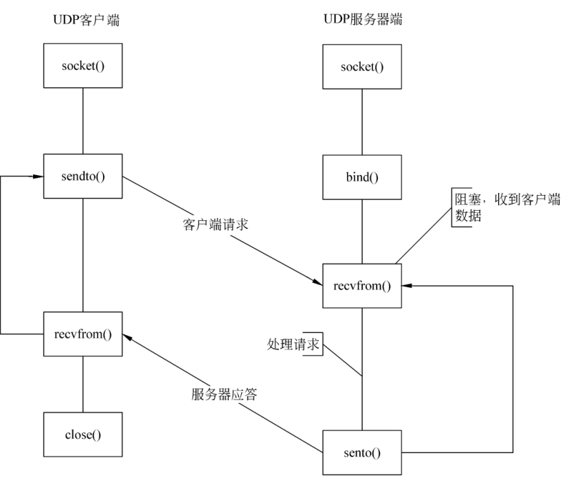

# 计算机网络知识点2

## 为什么TCP协议终止链接要四次
1. 当客户端确认发送完数据且知道服务器已经接收完了，想要关闭发送数据口（当然确认信号还是可以发），就会发FIN给服务器。
2. 服务器收到客户端发送的FIN，表示收到了，就会发送ACK回复。
3. 但这时候服务器可能还在发送数据，没有想要关闭数据口的意思，所以服务器的FIN与ACK不是同时发送的，而是等到服务器数据发送完了，才会发送FIN给客户端。
4. 客户端收到服务器发来的FIN，知道服务器的数据也发送完了，回复ACK， 客户端等待2MSL以后，没有收到服务器传来的任何消息，知道服务器已经收到自己的ACK了，客户端就关闭链接，服务器也关闭链接了。

2 MSL(Maximum Segment Lifetime, 报文的最大生存时间)意义：

1. 保证最后一次握手报文能到B，能进行超时重传。
2. 2MSL后，这次连接的所有报文都会消失，不会影响下一次连接。

## 请你来说一说http协议
1）HTTP协议：
HTTP协议是Hyper Text Transfer Protocol（超文本传输协议）的缩写，是用于从万维网（WWW:World Wide Web）服务器传输超文本到本地浏览器的传送协议。

HTTP是一个基于TCP/IP通信协议来传递数据（HTML 文件，图片文件，查询结果等）。

HTTP是一个属于应用层的面向对象的协议，由于其简捷、快速的方式，适用于分布式超媒体信息系统。它于1990年提出，经过几年的使用与发展，得到不断地完善和扩展。目前在WWW中使用的是HTTP/1.0的第六版，HTTP/1.1的规范化工作正在进行之中，而且HTTP-NG（Next Generation of HTTP）的建议已经提出。

HTTP协议工作于客户端-服务端架构之上。浏览器作为HTTP客户端通过URL向HTTP服务端即WEB服务器发送所有请求。Web服务器根据接收到的请求后，向客户端发送响应信息。

2）HTTP协议特点

1、简单快速：

客户向服务器请求服务时，只需传送请求方法和路径。请求方法常用的有GET、HEAD、POST。每种方法规定了客户与服务器联系的类型不同。由于HTTP协议简单，使得HTTP服务器的程序规模小，因而通信速度很快。

2、灵活：

HTTP允许传输任意类型的数据对象。正在传输的类型由Content-Type加以标记。

3、无连接：

无连接的含义是限制每次连接只处理一个请求。服务器处理完客户的请求，并收到客户的应答后，即断开连接。采用这种方式可以节省传输时间。

4、无状态：

HTTP协议是无状态协议。无状态是指协议对于事务处理没有记忆能力。缺少状态意味着如果后续处理需要前面的信息，则它必须重传，这样可能导致每次连接传送的数据量增大。另一方面，在服务器不需要先前信息时它的应答就较快。

5、支持B/S及C/S模式。

6、默认端口80

7、基于TCP协议

3）HTTP过程概述：

HTTP协议定义Web客户端如何从Web服务器请求Web页面，以及服务器如何把Web页面传送给客户端。HTTP协议采用了请求/响应模型。客户端向服务器发送一个请求报文，请求报文包含请求的方法、URL、协议版本、请求头部和请求数据。服务器以一个状态行作为响应，响应的内容包括协议的版本、成功或者错误代码、服务器信息、响应头部和响应数据。

HTTP 请求/响应的步骤如下：

1、客户端连接到Web服务器

一个HTTP客户端，通常是浏览器，与Web服务器的HTTP端口（默认为80）建立一个TCP套接字连接。例如，http://www.baidu.com。

2、发送HTTP请求

通过TCP套接字，客户端向Web服务器发送一个文本的请求报文，一个请求报文由请求行、请求头部、空行和请求数据4部分组成。

3、服务器接受请求并返回HTTP响应

Web服务器解析请求，定位请求资源。服务器将资源复本写到TCP套接字，由客户端读取。一个响应由状态行、响应头部、空行和响应数据4部分组成。

4、释放连接TCP连接

若connection 模式为close，则服务器主动关闭TCP连接，客户端被动关闭连接，释放TCP连接;若connection 模式为keepalive，则该连接会保持一段时间，在该时间内可以继续接收请求;

5、客户端浏览器解析HTML内容

客户端浏览器首先解析状态行，查看表明请求是否成功的状态代码。然后解析每一个响应头，响应头告知以下为若干字节的HTML文档和文档的字符集。客户端浏览器读取响应数据HTML，根据HTML的语法对其进行格式化，并在浏览器窗口中显示。

4、举例：

在浏览器地址栏键入URL，按下回车之后会经历以下流程：

1. 浏览器向 DNS 服务器请求解析该 URL 中的域名所对应的 IP 地址；
2. 解析出 IP 地址后，根据该 IP 地址和默认端口80，和服务器建立TCP连接；
3. 浏览器发出读取文件（URL中域名后面部分对应的文件）的HTTP 请求，该请求报文作为 TCP 三次握手的第三个报文的数据发送给服务器；
4. 服务器对浏览器请求作出响应，并把对应的 html 文本发送给浏览器；
5. 释放 TCP连接；
6. 浏览器将解析该 html 文本并显示内容；

## GET和POST的区别
1、概括

对于GET方式的请求，浏览器会把http header和data一并发送出去，服务器响应200（返回数据）；

而对于POST，浏览器先发送header，服务器响应100 continue，浏览器再发送data，服务器响应200 ok（返回数据）

参考：[为何GET只发一次TCP连接，POST发两次TCP连接](https://www.cnblogs.com/lixiuran/p/7977089.html)

2、区别：

1. get参数通过url传递，post放在request body中。
2. get请求在url中传递的参数是有长度限制的，而post没有。
3. get比post更不安全，因为参数直接暴露在url中，所以不能用来传递敏感信息。
4. get请求只能进行url编码，而post支持多种编码方式。
5. get请求会浏览器主动cache，而post不会，除非手动设置。
6. get请求参数会被完整保留在浏览历史记录里，而post中的参数不会被保留。
7. GET和POST本质上就是TCP链接，并无差别。但是由于HTTP的规定和浏览器/服务器的限制，导致他们在应用过程中体现出一些不同。
8. GET产生一个TCP数据包；POST产生两个TCP数据包。

## socket编程中服务器端和客户端主要用到哪些函数
1）基于TCP的socket：
1、服务器端程序：

1. 创建一个socket，用函数socket()
2. 绑定IP地址、端口等信息到socket上，用函数bind()
3. 设置允许的最大连接数，用函数listen()
4. 接收客户端上来的连接，用函数accept()
5. 收发数据，用函数send()和recv()，或者read()和write()
6. 关闭网络连接

2、客户端程序：

1. 创建一个socket，用函数socket()
2. 设置要连接的对方的IP地址和端口等属性
3. 连接服务器，用函数connect()
4. 收发数据，用函数send()和recv()，或read()和write()
5. 关闭网络连接

2）基于UDP的socket：

1、服务器端流程

1. 建立套接字文件描述符，使用函数socket()，生成套接字文件描述符。
2. 设置服务器地址和侦听端口，初始化要绑定的网络地址结构。
3. 绑定侦听端口，使用bind()函数，将套接字文件描述符和一个地址类型变量进行绑定。
4. 接收客户端的数据，使用recvfrom()函数接收客户端的网络数据。
5. 向客户端发送数据，使用sendto()函数向客户端发送数据。
6. 关闭套接字，使用close()函数释放资源。UDP协议的客户端流程

2、客户端流程

1. 建立套接字文件描述符，socket()。
2. 设置服务器地址和端口，struct sockaddr。
3. 向服务器发送数据，sendto()。
4. 接收服务器的数据，recvfrom()。
5. 关闭套接字，close()。

## 数字证书是什么，里面都包含哪些内容
1）概念：
数字证书在一个身份和该身份的持有者所拥有的公/私钥对之间建立了一种联系，由认证中心（CA）或者认证中心的下级认证中心颁发的。根证书是认证中心与用户建立信任关系的基础。在用户使用数字证书之前必须首先下载和安装。

认证中心是一家能向用户签发数字证书以确认用户身份的管理机构。为了防止数字凭证的伪造，认证中心的公共密钥必须是可靠的，认证中心必须公布其公共密钥或由更高级别的认证中心提供一个电子凭证来证明其公共密钥的有效性，后一种方法导致了多级别认证中心的出现。

2）数字证书颁发过程：

数字证书颁发过程如下：用户产生了自己的密钥对，并将公共密钥及部分个人身份信息传送给一家认证中心。认证中心在核实身份后，将执行一些必要的步骤，以确信请求确实由用户发送而来，然后，认证中心将发给用户一个数字证书，该证书内附了用户和他的密钥等信息，同时还附有对认证中心公共密钥加以确认的数字证书。当用户想证明其公开密钥的合法性时，就可以提供这一数字证书。

## udp的connect函数
一旦UDP套接字调用了connect系统调用，那么这个UDP上的连接就变成一对一的连接，但是通过这个UDP连接传输数据的性质还是不变的，仍然是不可靠的UDP连接。一旦变成一对一的连接，在调用系统调用发送和接受数据时也就可以使用TCP那一套系统调用了（即read/write/recv/send）。

## 阻塞，非阻塞，同步，异步
阻塞和非阻塞：调用者在事件没有发生的时候，一直在等待事件发生，不能去处理别的任务这是阻塞。调用者在事件没有发生的时候，可以去处理别的任务这是非阻塞。

同步和异步：调用者必须循环自去查看事件有没有发生，这种情况是同步。调用者不用自己去查看事件有没有发生，而是等待着注册在事件上的回调函数通知自己，这种情况是异步。

这里可以参考知乎上一个形象的解释：[怎样理解阻塞非阻塞与同步异步的区别？ - 愚抄的回答 - 知乎](https://www.zhihu.com/question/19732473/answer/23434554)

## Socket编程的send() recv() accept() socket()函数
send函数用来向TCP连接的另一端发送数据。客户程序一般用send函数向服务器发送请求，而服务器则通常用send函数来向客户程序发送应答,send的作用是将要发送的数据拷贝到缓冲区，协议负责传输。

recv函数用来从TCP连接的另一端接收数据，当应用程序调用recv函数时，recv先等待s的发送缓冲中的数据被协议传送完毕，然后从缓冲区中读取接收到的内容给应用层。

accept函数用了接收一个连接，内核维护了半连接队列和一个已完成连接队列，当队列为空的时候，accept函数阻塞，不为空的时候accept函数从上边取下来一个已完成连接，返回一个文件描述符。

socket函数用于创建一个socket。