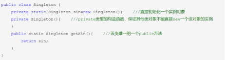
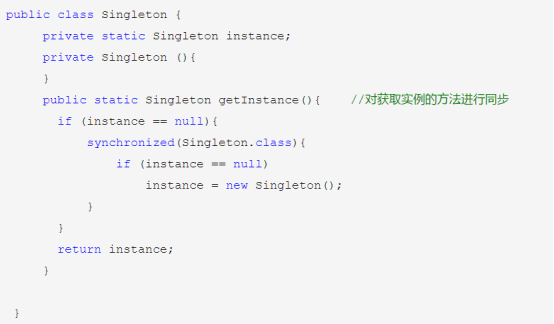

# 设计模式相应知识点
有兴趣的朋友可以参考：[Game Programming Patterns](http://gameprogrammingpatterns.com/contents.html)

这里就纯粹为了面试了。

## 用过哪些设计模式
单例模式：单例模式主要解决一个全局使用的类频繁的创建和销毁的问题。单例模式下可以确保某一个类只有一个实例，而且自行实例化并向整个系统提供这个实例。单例模式有三个要素：一是某个类只能有一个实例；二是它必须自行创建这个实例；三是它必须自行向整个系统提供这个实例。

工厂模式：工厂模式主要解决接口选择的问题。该模式下定义一个创建对象的接口（工厂类），让其子类自己决定实例化哪一个工厂类，使其创建过程延迟到子类进行。可参考[工厂模式](https://www.runoob.com/design-pattern/factory-pattern.html)。工厂模式的优点在于：
1. 一个调用者想创建一个对象，只要知道其名称就可以了。 
2. 扩展性高，如果想增加一个产品，只要扩展一个工厂类就可以。 
3. 屏蔽产品的具体实现，调用者只关心产品的接口。

观察者模式：定义对象间的一种一对多的依赖关系，当一个对象的状态发生改变时，所有依赖于它的对象都得到通知并被自动更新。

## 单例模式的多线程安全问题
在单例模式的实现中，如果不采取任何措施，在多线程下是不安全的，可能会同时创建多个实例。因此，为了保证单例模式在多线程下的线程安全，一般采用下面几种方式实现单例模式：

1)饿汉式：基于class loader机制避免多线程的同步问题，不过，instance在类装载时就实例化，可能会产生垃圾对象。



2)懒汉式：通过双重检验锁机制实现线程安全（即在加锁处理里面还需要判断一次实例是否已存在）。



可参考：[Java实现单例模式（懒汉式、饿汉式、双重检验锁、静态内部类方式、枚举方式）](https://blog.csdn.net/u011595939/article/details/79972371)

## 手撕单例模式
```cpp
template <class T>
class SingleTon
{
    private:
        SingleTon() {};
        SingleTon(const SingleTon&) {}; // 禁止拷贝

        SingleTon& operator=(const SingleTon&) {}; // 禁止赋值
        static T* uniqueInstance;
        static pthread_mutex_t mutex;
    public:
        static T* GetInstance()
        {
            // 双重验证锁
            if (uniqueInstance == nullptr)
            {
                pthread_mutex_lock(&mutex);
                if (uniqueInstance == nullptr)
                {
                    uniqueInstance = new T();
                }
                pthread_mutex_unlock(&mutex);
            }
            
            return uniqueInstance;
        }
};

template <class T>
pthread_mutex_t SingleTon<T>::mutex = PTHREAD_MUTEX_INITIALIZER;

template <class T>
T* SingleTon<T>::uniqueInstance = nullptr;
```
